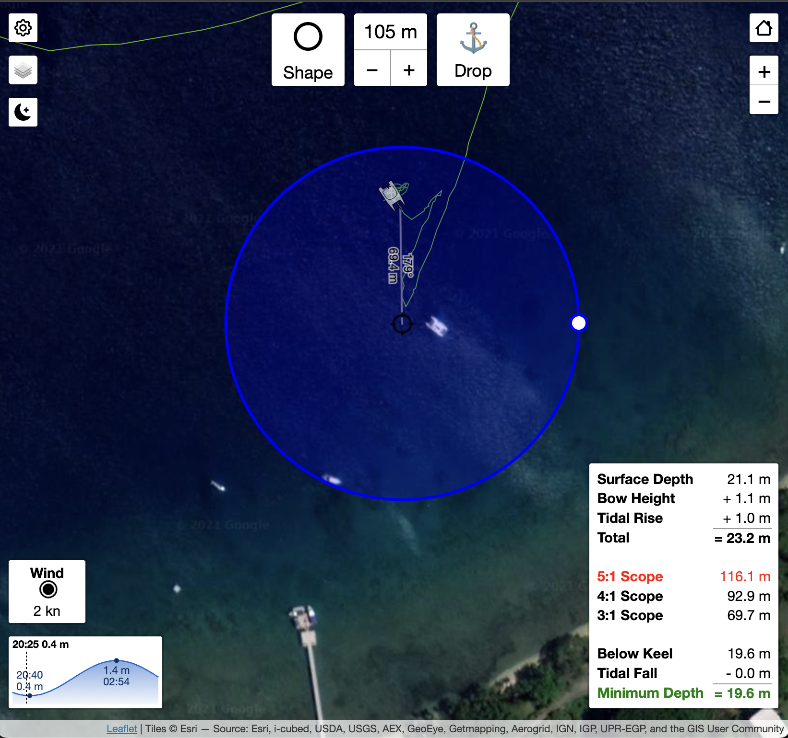
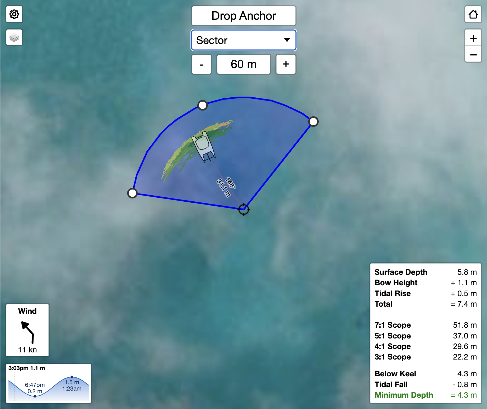

# hoekens-anchor-alarm

A simple web UI anchor alarm for [SignalK](https://signalk.org/), built for setting from your phone, tablet or computer.  Handy for setting the anchor alarm from the helm, or a quick check from bed when the wind picks up at 2am.

This started life as a fork of the venerable [signalk-anchoralarm-plugin](https://github.com/sbender9/signalk-anchoralarm-plugin) by Scott Bender, but has since grown its own personality (and a fair bit of new code). The goal is a focused web UI with my own style and a few opinionated features, like automatically cancelling the alarm when your engines fire up. If you'd rather drive everything from an external app or API, the original plugin might be a better fit for you.

## Features

### 👀 Watch zones that aren't just circles

The classic circle is still here (now resizable by dragging a handle on the rim), but you can also switch to a **sector** (radius plus a draggable arc, handy when your safe swing is only astern), or a free-form **polygon** with draggable vertices. Drag an edge midpoint to add a point, drag a vertex onto its neighbor to remove it. Self-intersection is prevented for you, so you can't tie your watch zone in a knot.

### ⚓ Physically accurate boat icons

Give it your beam, LOA, and GPS antenna position and the boat icon is drawn to your boat's *true* size, rotating around the antenna location. At high zoom this is genuinely useful: pre-pick your spot on satellite imagery, line your bow up over the anchor icon, and drop. The alarm triggers on your GPS antenna position leaving the zone, so set your offset and it all lines up.

### 📐 Scope calculator

When the anchor's up, a panel shows what your scope would be at 3:1, 4:1, 5:1, and 7:1, based on current depth, your bow height above water, and estimated tidal rise. Install [signalk-tides](https://github.com/bkeepers/signalk-tides) for the tide data. It'll also flag rows in red if the required rode exceeds the chain you actually have aboard (set `totalAnchorChainLength` in the config).

### 🔧 Engine override

I always forget to switch the alarm off before motoring away, so now I don't have to. If you've got engine data in SignalK (`propulsion.*.rpm` or `propulsion.*.state`), starting your engines silences an *active* alarm. It only kicks in when you're already outside the zone (motoring away or firing up the motor to reposition while dragging), so it just quiets the alarm you already know about. Anchor watch keeps running, and as long as you're inside the circle nothing changes.

### 🛰️ Tracks & fleet

Historical tracks are color-coded (green for fresh, fading to red as they age) via the [@signalk/tracks-plugin](https://github.com/SignalK/tracks). Other AIS vessels show up too, with their own tracks and accurately-typed icons. Click a vessel for a detailed popup: name, MMSI, length, beam, distance, bearing, SOG, and COG.

### 🕰️ Past anchorages

If your server has a history provider plugin (e.g. [signalk-questdb](https://github.com/dirkwa/signalk-questdb)), the plugin logs every anchoring session (drop and raise times, anchor position, watch zone) and a clock button appears on the map. It opens a list of past anchorages; pick one and its full vessel track is reconstructed from the server's recorded position history and drawn on the map. The same mechanism rehydrates the live scribble track after a server restart mid-anchorage — the in-memory tracks plugin loses it, the history provider doesn't. Without a history provider everything behaves as before.

### 📊 Heads-up panels

Compact HUD panels for wind (with a wind barb on the map), depth, tide state (plus the next two tides), and anchor status. They show and hide themselves based on what data is actually available, so you're never staring at a panel full of dashes.

### ⚙️ In-map settings

Logged-in users can tweak the UI without leaving for the plugin config page. A gear button opens a settings dialog (panel toggles, basemap, default zone shape, fleet radius, connection type) and most changes apply live.

## Usage

This plugin is meant to be used through the web interface on a phone or computer. Point your browser at:

```
http://[signalk-server-ip-address]:[port-number]/hoekens-anchor-alarm/
```

The way I use it: anchor the boat first, then once I'm settled I open the webapp and set the alarm. This is where high-resolution tracks earn their keep; you can usually see exactly where you dropped the hook. Set your radius a touch bigger than feels necessary to avoid false alarms in the night.

It's also handy to use a circle zone to *choose* your spot first: position the zone where you want to anchor, then drive your boat icon until the bow sits right over the anchor icon, and let go. Since v1.3 the icons are physically accurate at high zoom, so you can get surprisingly precise, just make sure you've set your GPS antenna offset!

If you have engine data in SignalK, enable the engine check and the watch will end on its own when you motor off (see Engine override above).

> [!NOTE]
> You can view the app without logging in (read-only). Editing controls (dropping/raising the anchor, resizing zones, settings) appear once you log into your SignalK server.

## Embedding

If you want to drop the anchor alarm into another app or a dashboard (Grafana, a Node-RED dashboard, an MFD page, a custom SignalK webapp, an `<iframe>`), two query-string parameters let you trim the UI down to just the map. Add them to the webapp URL:

```
http://[signalk-server-ip-address]:[port-number]/hoekens-anchor-alarm/?embedded=true&showAnchorControls=false
```

| Parameter | Values | Default | Effect |
|---|---|---|---|
| `embedded` | `true` / `false` | `false` | When `true`, hides the tide, wind, scope, and info panels, along with the settings (gear) control, leaving a clean map. `false` or omitted changes nothing. |
| `showAnchorControls` | `true` / `false` | `true` | When `false`, hides the top anchor toolbar (shape picker, radius, drop/raise). When `true`, shows it. |

The two are independent, so mix and match to taste:

- `?embedded=true` — clean map that still keeps the anchor toolbar for setting the alarm from within the host app.
- `?embedded=true&showAnchorControls=false` — a bare map with no controls at all, for a read-only status tile.
- `?showAnchorControls=false` — the full HUD panels but no anchor toolbar.

Values are compared case-insensitively; anything other than `true` is treated as `false`. These parameters only affect what the webapp renders — the map, watch zone, boat, and fleet still update live, and none of your saved plugin settings are changed.

> [!TIP]
> These pair well with the existing `?mode=night` / `?mode=day` parameter (used by B&G/Navico MFDs), which forces the dark or light theme instead of following the device preference.

## API

Besides the web UI, the plugin exposes an HTTP API (drop/raise the anchor, set the watch zone, manage settings and the boat icon) and publishes anchor state on the Signal K tree (`navigation.anchor.*` and the `notifications.navigation.anchor` alarm). If you want to drive the anchor watch from another app, a dashboard, or a script, see **[docs/API.md](docs/API.md)**. The machine-readable OpenAPI spec is also browsable in the Signal K admin UI under *Documentation → OpenAPI*.

## Watch Zone Shapes

| Circle | Sector | Polygon |
|:--:|:--:|:--:|
| [](docs/screenshots/circle.png) | [](docs/screenshots/sector.png) | [](docs/screenshots/polygon.png) |

## Recommendations

This app pairs well with some other software:

- **[@signalk/tracks-plugin](https://github.com/SignalK/tracks)**: required for the historical tracks. I recommend a resolution of 1000ms and 86400 points, which gives you high-resolution data for the last 24 hours. If you've got the memory, you might as well use it.
- **[signalk-questdb](https://github.com/dirkwa/signalk-questdb)** (or any v2 History API provider): enables the past-anchorages browser and makes the live scribble track survive server restarts.
- **[signalk-tides](https://github.com/bkeepers/signalk-tides)**: feeds the scope calculator and tide panel.
- **[signalk-autostate](https://github.com/meri-imperiumi/signalk-autostate)**: just by using the anchor app, the plugin can tell the difference between moored and anchored. Great for automating things like an anchor light.
- **Node-RED + Pushbullet**: for push notifications to your phone. Really great for when you're off the boat, and handy on the boat too.
- **[Tailscale](https://tailscale.com/)**: makes accessing SignalK remotely dead simple. Free, and a five-minute setup.

## Contributing

Issues and PRs are welcome; this is an open source project and I'm happy to have company. See [DEVELOPMENT.md](DEVELOPMENT.md) for getting set up, and [CHANGELOG.md](CHANGELOG.md) for the full history of what's changed.

## Attribution

[Anchor icons created by Freepik - Flaticon](https://www.flaticon.com/free-icons/anchor)
